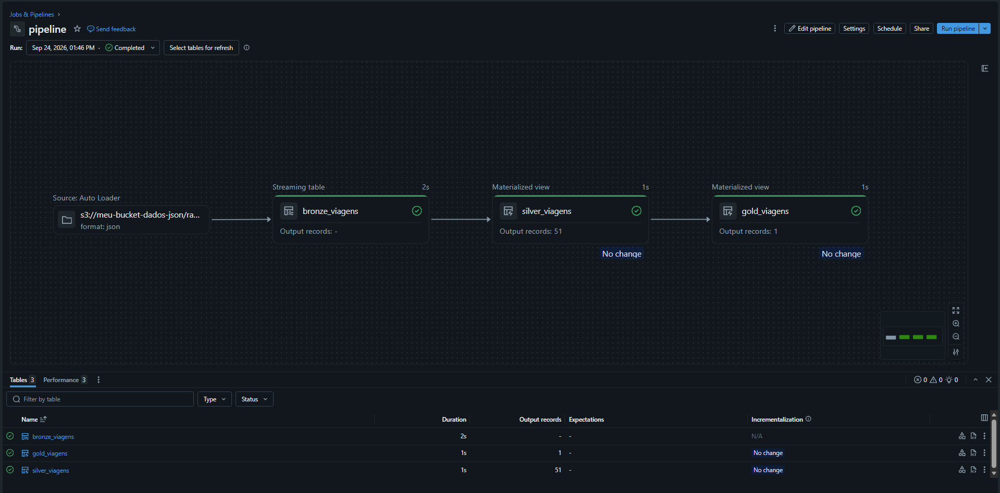

# Databricks, S3 & Power BI - Passageiros Impactados

## Descrição
Pipeline no **Databricks** que captura, de forma incremental, dados brutos de movimentação de trens de um **bucket S3**, processando-os através de uma **arquitetura medallion** até uma camada gold que alimenta um dashboard no Power BI que quantifica **`passageiros impactados`** por atraso nos trens, fornecendo indicadores solicitados pela gestão para acompanhamento da operação.

## Contexto e detalhes do negócio
Numa estação de trem, o intervalo em minutos entre um trem e outro é chamado de **`headway`**. Para cada horário do dia existe um headway programado (nos horários de pico é menor, no vale maior). Quando o headway programado é violado em 100%, uma quantidade significativa de passageiros é impactado.

Suponha um trecho com 10 estações. Para identificar os headways violados, basta ir na estação 1 e ver o horário que todos os trens dali partiram naquele dia, calcular o intervalo entre eles e, para cada intervalo, comparar com o programado para aquele horário.

Exemplo:

| Data | Prefixo do Trem | Estação de Partida | Estação de Destino | Horário Partida |
|---|---|---|---|---|
| 2026-09-20 | T001 | A | J | 12:00:00 | 
| 2026-09-20 | T002 | A | J | 12:04:00 | 
| 2026-09-20 | T003 | A | J | 12:12:00 | 
| 2026-09-20 | T004 | A | J | 12:16:00 | 

Suponha que o intervalo programado para esse horário fosse de 4 minutos, mas entre o trem T002 e o trem T003, houve um intervalo de 8 minutos (atraso de 100%): são nessas viagens que o estudo busca quantificar os impactados.

A função do pipeline é transformar os dados brutos das viagens no formato exemplificado para facilitar o cálculo.

## Arquitetura

### Camada Bronze
Dados brutos armazenados no S3.

| Tabela | Arquivo | Origem | Descrição |
|---|---|---|---|
| `bronze_viagens` | 01_bronze_viagens.py | S3 | Ingestão incremental dos eventos de viagens via AutoLoader. Cada linha representa uma estação que um trem passou durante uma viagem, com informações de horário de chegada e partida, nome da estação, número do trem e data da viagem. |

### Camada Silver
Limpeza e padronização.

| Tabela | Arquivo | O que faz
|---|---|---|
| `silver_viagens` | 02_silver_viagens.py | Tratamento dos dados brutos: formato das colunas, criação de colunas auxiliares e correção de valores |

### Camada Gold
Aplicação das regras de negócio.

| Tabela | Arquivo | O que faz
|---|---|---|
| `gold_viagens` | 03_gold_viagens.py | Filtragem das viagens aplicado as regras de negócio e cálculo do headway |

### Stack

- Databricks (DLT, Auto Loader, Unity Catalog)
- AWS S3 Bucket
- Arquitetura Medallion
- Power BI.

